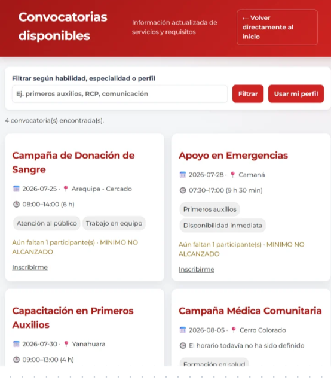
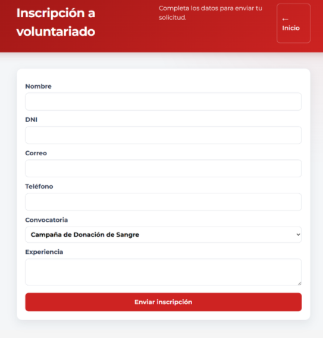
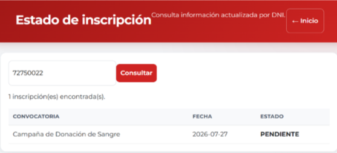
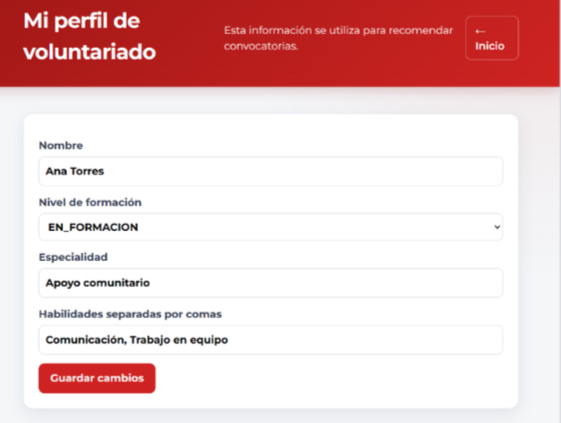
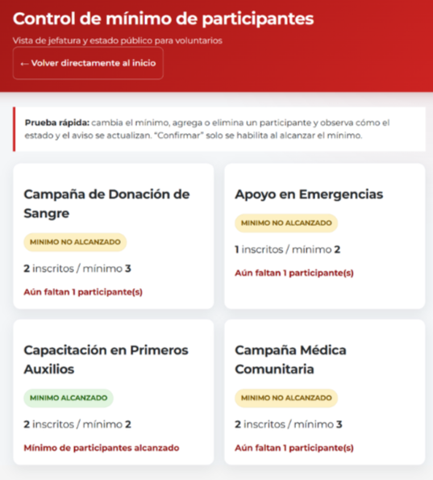
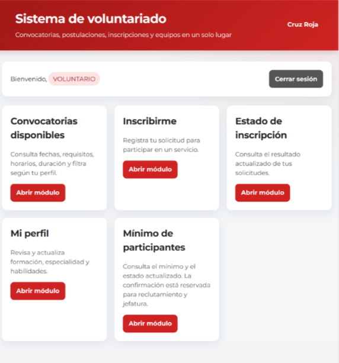
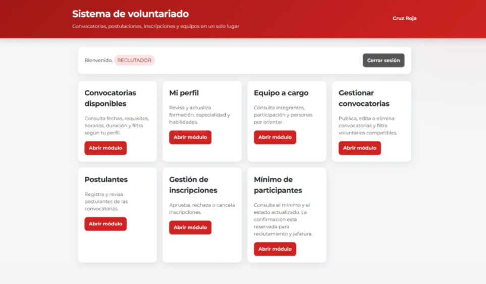
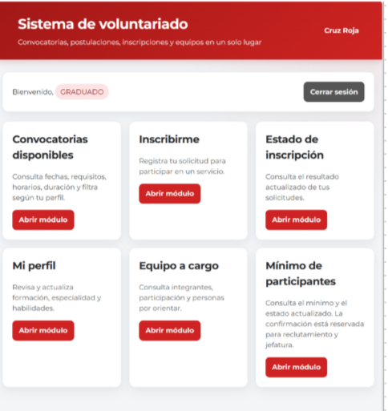
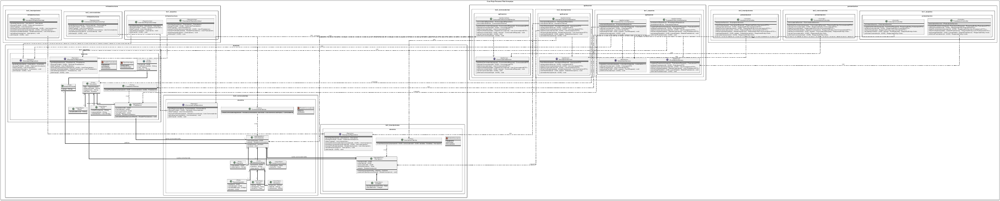

# Sistema de Convocatorias — Cruz Roja Peruana, Filial Arequipa

Aplicación web para gestionar convocatorias de servicios, postulaciones e inscripciones de voluntarios de la Cruz Roja Peruana Filial Arequipa.

**Curso:** Ingeniería de Software I (2026-B) · **Docente:** Edgar Sarmiento Calisaya

---

## Índice

1. [Equipo e integrantes](#1-equipo-e-integrantes)
2. [Propósito](#2-propósito)
3. [Funcionalidades](#3-funcionalidades)
   - [3.1 Prototipo / GUI](#31-prototipo--gui)
4. [Modelo de Dominio](#4-modelo-de-dominio)
5. [Visión General de Arquitectura](#5-visión-general-de-arquitectura)
6. [Prácticas de Desarrollo Aplicadas](#6-prácticas-de-desarrollo-aplicadas)
   - [6.1 Evidencia consolidada — BC3 Inscripciones (Natalie Lazo)](#61-evidencia-consolidada--bc3-inscripciones-natalie-lazo)
   - [6.2 Perfil del voluntario (David Quispe)](#62-perfil-del-voluntario-david-quispe)
   - [6.3 Inscripciones (Micaela Uribe)](#63-inscripciones-micaela-uribe)
   - [6.4 Participantes / Postulación (Lizeth Tito)](#64-participantes--postulación-lizeth-tito)
   - [6.5 Convocatorias y Autorización (Katherin Zenayuca)](#65-convocatorias-y-autorización-katherin-zenayuca)
   - [6.6 Convocatorias — integración (Sharmely Quispe)](#66-convocatorias--integración-sharmely-quispe)
7. [Tecnologías](#7-tecnologías)
8. [Instalación y ejecución](#8-instalación-y-ejecución)
9. [Estructura del repositorio y ramas](#9-estructura-del-repositorio-y-ramas)
10. [Gestión del proyecto (Trello)](#10-gestión-del-proyecto-trello)

---

## 1. Equipo e integrantes

| # | Integrante | Módulo / Requisito principal |
|---|------------|------------------------------|
| 1 | Natalie Marleny Lazo Paxi | BC3 Inscripciones — HF.3.2.1 Ver estado de inscripción |
| 2 | Sharmely Yesenia Quispe Chavez | RF.1 Convocatorias · BC3 Inscripciones (`feature/mi_parte`) · propietaria del repositorio |
| 3 | David Augusto Quispe Lloccallasi | RF.4 Perfil · RF.1 Convocatorias |
| 4 | Micaela Belén Uribe Zuñiga | RF.2 Participantes · BC3 Inscripciones · RF.5 Agendas |
| 5 | Lizeth Angelica Tito Vilca | RF.2 Participantes (`parte_l`) · BC3 Inscripciones |
| 6 | Katherin Milagros Zenayuca Corimanya | RF.2 Participantes · RF.5 Agendas · RNF.1.2 |


---

## 2. Propósito

El proceso de inscripción a las convocatorias mensuales de la Cruz Roja Filial Arequipa es hoy manual —se difunde por Facebook y grupos de WhatsApp—, lo que genera desorganización, pérdida de información y demoras en cubrir cupos críticos.

Este sistema **filtra automáticamente los servicios disponibles** según el perfil y el nivel de formación del voluntario, y permite **inscribirse, gestionar y dar seguimiento** a esas inscripciones, ordenando el proceso de principio a fin.

---

## 3. Funcionalidades

Requisitos funcionales priorizados:

| ID | Feature | Prioridad |
|----|---------|-----------|
| RF.1 | Gestión de Convocatorias (publicar, editar/eliminar) | Alta |
| RF.2 | Gestión de Participantes (registrar, filtrar, verificar mínimo) | Alta |
| RF.3 | Gestión de Inscripciones (inscribir, ver estado, convocatorias por perfil) | Alta |
| RF.4 | Gestión de Perfil (perfil, equipo a cargo) | Media |
| RF.5 | Gestión de Agendas (horarios, estado de convocatoria) | Alta / Media |
| RNF.1.1 | Login seguro | Alta |
| RNF.1.2 | Tiempo de actualización < 5 min | Media |

### 3.1 Prototipo / GUI

Vistas implementadas (HTML + CSS + JS): `main.html`, `convocatorias.html`, `inscripcion.html`, `estado_inscripcion.html`, `gestion_inscripciones.html`, `perfil_voluntario.html`.

Página de inicio que visualizan los voluntarios:


| Convocatorias disponibles | Inscripción | Estado de inscripción |
|---|---|---|
|  |  |  |

| Perfil del voluntario | Mínimo de participantes | Login Voluntario |
|---|---|---|
|  |  |  |

| Login Jefatura | Login Graduado |
|---|---|
|  |  |

---

## 4. Modelo de Dominio

El dominio se organiza en tres **Bounded Contexts (BC)**:

- **BC1 Usuarios** — voluntarios y postulaciones.
- **BC2 Convocatorias** — convocatorias, requisitos y servicios.
- **BC3 Inscripciones** — inscripción y seguimiento de estado.

Elementos DDD presentes: **Entidades** (p. ej. `Inscripcion`), **Objetos de Valor**, **Enumeraciones de dominio** (`EstadoInscripcion`), **Fábricas** y **Repositorios**.



---

## 5. Visión General de Arquitectura

El proyecto sigue **DDD + MVC + Módulos + Arquitectura en Capas**. Cada Bounded Context se estructura en cuatro capas con dependencias hacia el dominio:

- **Presentación** (`presentacion`): controladores y *requests*. Recibe peticiones HTTP y devuelve respuestas; no contiene lógica de negocio.
- **Aplicación** (`aplicacion`): servicios de aplicación, DTO e interfaces. Orquesta casos de uso.
- **Dominio** (`dominio`): entidades, objetos de valor, fábricas, enums, excepciones e interfaces de repositorio. Concentra las reglas de negocio.
- **Infraestructura** (`infraestructura`): implementaciones de persistencia.


---

## 6. Prácticas de Desarrollo Aplicadas

Las prácticas de desarrollo se aplicaron a nivel de proyecto con participación individual documentada. La **evidencia consolidada** (6.1) proviene del módulo BC3 Inscripciones; las secciones **6.2–6.6** presentan la contribución de cada integrante sobre su módulo asignado — estilos de programación, Clean Code y principios SOLID — con fragmentos de código del proyecto y verificación mediante SonarLint.

### 6.1 Evidencia consolidada — BC3 Inscripciones (Natalie Lazo)

> Requisito **HF.3.2.1 — Ver estado de inscripción**, verificado con **SonarLint**. Cubre convenciones, cuatro estilos, las siete categorías de Clean Code y los cinco principios SOLID.

#### Convenciones de Codificación

Se aplican las **Java Naming Conventions**: clases en `PascalCase`, métodos y atributos en `camelCase`, constantes en `MAYÚSCULAS`, e interfaces de repositorio con prefijo `I`. Un `import` por línea, sin comodines; indentación de 4 espacios.

```java
public interface IConsultaInscripcionRepositorio {
    List<Inscripcion> buscarPorDni(String dni);
}
```

> **Hallazgo documentado (`java:S120`):** los paquetes `bc3_inscripciones` contienen un dígito, lo que SonarLint marca como advertencia. El nombre proviene de la estructura de Bounded Contexts acordada por el equipo; su corrección exige una refactorización coordinada, por lo que se mantiene documentado como decisión de equipo.

#### Estilos de Programación

Se aplicaron **cuatro estilos** del catálogo de Lopes, *Exercises in Programming Style*, sobre el módulo BC3.

**Things (orientado a objetos).** El estado y la inscripción son objetos que encapsulan atributos y comportamiento. El enum guarda su descripción legible y decide cuándo es un estado final.

```java
public enum EstadoInscripcion {
    PENDIENTE("Pendiente"), CONFIRMADA("Confirmada"), RECHAZADA("Rechazada");
    private final String descripcion;
    EstadoInscripcion(String descripcion) { this.descripcion = descripcion; }
    public String getDescripcion() { return descripcion; }
    public boolean esFinal() { return this == CONFIRMADA || this == RECHAZADA; }
}
```

**Error / Exception Handling.** Las reglas de negocio inválidas se señalan con una excepción de dominio, no con códigos de retorno.

```java
public void rechazar() {
    validarTransicionHacia(EstadoInscripcion.RECHAZADA);
    this.estado = EstadoInscripcion.RECHAZADA;
}

private void validarTransicionHacia(EstadoInscripcion nuevoEstado) {
    if (this.estado.esFinal()) {
        throw new TransicionEstadoInvalidaException(this.estado, nuevoEstado);
    }
}
```

**Lazy Rivers (pipeline con Streams).** La consulta se expresa como un flujo de operaciones encadenadas, sin bucles ni variables mutables.

```java
public List<InscripcionDTO> consultarPorDni(String dni, List<Inscripcion> inscripciones) {
    return inscripciones.stream()
        .filter(inscripcion -> inscripcion.getDniVoluntario().equals(dni))
        .sorted(Comparator.comparing(Inscripcion::getFechaInscripcion))
        .map(this::aDTO)
        .collect(Collectors.toUnmodifiableList());
}
```

**Trinity (MVC).** El controlador recibe la petición de la vista, delega la lógica en el servicio de aplicación y devuelve el modelo (DTOs) ya preparado.

```java
public class InscripcionController {
    private final ConsultaInscripcionesServicio consultaInscripciones;

    public List<InscripcionDTO> verEstadoPorDni(String dni, List<Inscripcion> inscripciones) {
        return consultaInscripciones.consultarPorDni(dni, inscripciones);
    }
}
```

#### Clean Code

Se aplicó al menos una práctica por cada categoría de Clean Code (Martin, 2009).

**Nombres — revelan intención.** `esFinal()` comunica que un estado ya no admite transiciones; `validarTransicionHacia(nuevoEstado)` dice qué valida y contra qué.

```java
public boolean esFinal() {
    return this == CONFIRMADA || this == RECHAZADA;
}
```

**Funciones — pequeñas, una sola cosa.** `confirmar()` y `rechazar()` no repiten lógica: ambas delegan en `cambiarEstadoHacia()`, que separa validación de asignación.

```java
public void confirmar() {
    cambiarEstadoHacia(EstadoInscripcion.CONFIRMADA);
}

private void cambiarEstadoHacia(EstadoInscripcion nuevoEstado) {
    validarTransicionHacia(nuevoEstado);
    this.estado = nuevoEstado;
}
```

**Comentarios — explican el porqué, no repiten el código.**

```java
/**
 * Confirma la inscripción cuando la convocatoria alcanza
 * el mínimo de participantes (regla de negocio HF.2.3.1).
 */
public void confirmar() { ... }
```

**Estructura de Código Fuente — formato vertical (metáfora del periódico).** La clase se lee de arriba hacia abajo: atributos → constructor → comportamiento público → *helpers* privados → getters → `equals`/`hashCode`.

```java
public class Inscripcion {
    // 1) atributos privados
    // 2) constructor
    // 3) comportamiento público: confirmar(), rechazar()
    // 4) helpers privados: cambiarEstadoHacia(), validarTransicionHacia()
    // 5) getters · 6) equals() / hashCode()
}
```

**Objetos y Estructuras de Datos — asimetría objeto/estructura.** `Inscripcion` oculta datos y expone comportamiento; `InscripcionDTO` es una estructura sin lógica que solo transporta lo que la vista necesita.

```java
public class InscripcionDTO {
    private final String estadoDescripcion;
    public String getEstadoDescripcion() { return estadoDescripcion; }
}
```

**Tratamiento de Errores — excepciones con contexto y sin `null`.** Validación *fail fast* en el constructor; el servicio nunca retorna `null`.

```java
this.id = Objects.requireNonNull(id, "El id de la inscripción es obligatorio");

if (esDniInvalido(dni) || inscripciones == null) {
    return List.of(); // nunca null
}
```

**Clases — pequeñas y con una única responsabilidad.** `ConsultaInscripcionesServicio` solo consulta; `InscripcionController` solo coordina; `TransicionEstadoInvalidaException` solo representa un error de dominio.

#### Principios SOLID

| Principio | Aplicación en HF.3.2.1 | Archivo(s) |
|-----------|------------------------|-----------|
| **SRP** | El mapeo entidad→DTO se extrae a un ensamblador dedicado; cada clase tiene una sola razón de cambio. | `InscripcionEstadoAssembler` |
| **OCP** | Filtrado extensible con patrón *Specification*: nuevos criterios sin modificar el servicio. | `CriterioInscripcion`, `CriterioPorEstado` |
| **LSP** | Todo criterio (o repositorio) es sustituible respetando el mismo contrato. | `CriterioTodas`, repositorios |
| **ISP** | Puerto de solo lectura para una funcionalidad de solo consulta. | `IConsultaInscripcionRepositorio` |
| **DIP** | El servicio depende de abstracciones inyectadas por constructor, no de concreciones. | `ConsultaInscripcionesServicio` |

```java
// DIP — el servicio depende de la abstracción, no de la implementación concreta
public class ConsultaInscripcionesServicio {
    private final IConsultaInscripcionRepositorio repositorio;

    public ConsultaInscripcionesServicio(IConsultaInscripcionRepositorio repositorio) {
        this.repositorio = repositorio;
    }
}
```

#### Domain-Driven Design

El diseño expone explícitamente **Entidades** (`Inscripcion`), **Objetos de Valor**, **Enumeraciones de dominio** (`EstadoInscripcion`), **Fábricas**, **Repositorios** (interfaces en el dominio) y **Módulos** (Bounded Contexts).


### 6.2 Perfil del voluntario (David Quispe)

> Módulo **RF.4 — Gestión de Perfil** (`bc1_usuarios`). Evidencia documentada en sus Laboratorios 10, 11 y 12, verificada con SonarQube (se documentan una redundancia y un falso positivo analizados).

#### Estilos de Programación

**Things (orientado a objetos).** La información que el usuario envía para modificar sus datos personales se encapsula en un objeto propio, `PerfilRequest`, de modo que los distintos componentes del sistema trabajan con una estructura definida y no con parámetros sueltos.

```java
public class PerfilRequest {
    private String nombres;
    private String apellidos;
    private String telefono;
    private String direccion;
    // getters y setters
}
```

**Pipeline (flujo de procesamiento).** La información atraviesa etapas definidas antes de completar la actualización: formulario → controlador → servicio → redirección.

```java
@PostMapping("/actualizar")
public String actualizarPerfil(PerfilRequest request) {
    servicio.actualizarPerfil(request);
    return "redirect:/perfil/actualizar";
}
```

**Constraints (restricciones).** El servicio impone validaciones de negocio antes de persistir, evitando que se almacenen datos incompletos.

```java
public void actualizarPerfil(PerfilRequest request) {
    if (request.getNombres().isEmpty()) {
        throw new IllegalArgumentException("El nombre es obligatorio");
    }
    // se persiste solo si pasa la validación
}
```

**Kick Forward (delegación de responsabilidades).** El controlador no valida ni modifica datos: su única responsabilidad es recibir la petición y delegarla al componente especializado (el servicio de aplicación), como se ve en el mismo fragmento del estilo Pipeline.

#### Clean Code

Cuatro prácticas documentadas: **Nombres descriptivos** (`nombres`, `apellidos`, `telefono`, `direccion` comunican su propósito sin revisar la implementación); **Eliminación de código innecesario** — se removió un `import` sin uso detectado en la revisión:

```java
// Eliminado por no ser utilizado:
import org.springframework.web.bind.annotation.ResponseBody;
```

**Separación de responsabilidades** (Controller recibe solicitudes · Service aplica reglas de negocio · Repositorio guarda datos) y **Responsabilidad Única** (si cambia la interfaz no debería cambiar el servicio; si cambia la base de datos no debería cambiar el controlador).


#### Principios SOLID

**SRP.** Cada controlador cumple una sola función: `MainController` solo sirve la página de inicio, `ConvocatoriaController` solo sirve su vista.

```java
@Controller
public class MainController {
    @GetMapping("/")
    public String main() { return "main"; }
}
```

**OCP.** Para añadir datos de contacto al perfil, en vez de modificar el constructor de `Voluntario` en uso (lo que habría roto el código que ya lo llamaba), lo **extendió** con un constructor nuevo que delega en el original, más un método de dominio `actualizarPerfil(...)` para editar sin tocar la construcción.

```java
// Constructor original: mantiene compatibilidad con el código previo
public Voluntario(String dni, String nombreCompleto, Perfil perfil, String disponibilidad) {
    this(dni, nombreCompleto, perfil, disponibilidad, "", "", "");
}

// Constructor completo (extensión, no modificación)
public Voluntario(String dni, String nombreCompleto, Perfil perfil, String disponibilidad,
                  String correo, String telefono, String direccion) { /* ... */ }
```

**DIP — detección y reparación de una violación real.** `PostulacionController` dependía de la clase concreta `PostulacionServicioAplicacion`. Se documentó el ANTES (viola DIP) y la SOLUCIÓN: introducir la abstracción faltante y dejar al controlador dependiendo del contrato.

```java
public interface IPostulacionServicio {
    Postulacion registrarPostulante(String dni, String nombreCompleto, /* ... */ Long convocatoriaId);
    List<Postulacion> listarPostulantes();
}

@Controller
@RequestMapping("/postulantes")
public class PostulacionController {
    private final IPostulacionServicio postulacionServicio; // ahora es una abstracción
}
```

**ISP.** Interfaces de persistencia pequeñas y por dominio: `IPostulacionRepositorio` solo expone lo que su caso de uso necesita (`guardar`, `existePostulacion`, `listarTodas`, `siguienteId`) e `IConvocatoriaRepositorio`, de forma independiente, solo lo que compete a convocatorias.

**Nota sobre LSP.** El entregable documenta explícitamente que en su parte no existen jerarquías de herencia, por lo que no se fuerza un ejemplo artificial del principio — decisión de alcance honesta y correcta.


### 6.3 Inscripciones (Micaela Uribe)

> Módulo **RF.3 — Gestión de Inscripciones** (`bc3_inscripciones`, API REST). Evidencia documentada en sus Laboratorios 10, 11 y 12.

#### Estilos de Programación

**Cook Book.** En el frontend, los procedimientos se comunican mediante estado compartido: `verDetalle()` escribe las variables globales `convocatoriaSeleccionada` e `inscripcionesDeLaConvocatoria`, y el evento del botón "Inscribirme" las lee directamente más adelante, sin pasárselas como argumento.

```javascript
let convocatoriaSeleccionada = null;
let inscripcionesDeLaConvocatoria = [];

async function verDetalle(id) {
    convocatoriaSeleccionada = await (await fetch(/* ... */)).json();
    inscripcionesDeLaConvocatoria = await (await fetch(/* ... */)).json();
}
```

**Orientado a objetos (Things).** `Inscripcion` agrupa estado y comportamiento: el propio objeto decide sobre su estado interno con `verificarCupo()` y `cambiarEstado()`, protegiendo la invariante de que una inscripción rechazada no cambia.

```java
public void cambiarEstado(EstadoInscripcion nuevoEstado) {
    if (estado == EstadoInscripcion.RECHAZADA) {
        throw new IllegalStateException("No se puede cambiar el estado de una inscripción rechazada");
    }
    this.estado = nuevoEstado;
}
```

**Error Handling (Passive-Aggressive).** La excepción se lanza justo donde ocurre el error, no se atrapa en el medio, y un nivel superior la traduce: el servicio lanza `IllegalStateException` con el mensaje de negocio, el controlador no atrapa nada, y el `GlobalExceptionHandler` la convierte en una respuesta HTTP coherente.

```java
// Abajo (servicio): se lanza
if (yaInscrito) {
    throw new IllegalStateException("Ya estás inscrito en esta convocatoria");
}

// Arriba (manejador global): se atrapa y traduce
@RestControllerAdvice
public class GlobalExceptionHandler {
    @ExceptionHandler(IllegalStateException.class)
    public ResponseEntity<Map<String, String>> manejarReglaDeNegocio(IllegalStateException ex) {
        return ResponseEntity.status(HttpStatus.CONFLICT).body(Map.of("error", ex.getMessage()));
    }
}
```

**RESTful.** Cada operación sobre el recurso queda identificada únicamente por el verbo HTTP más la URL, sin parámetros que indiquen la acción.

```java
@RestController
@RequestMapping("/api/inscripciones")
public class InscripcionController {
    @PostMapping
    public ResponseEntity<InscripcionDTO> inscribirse(@RequestBody InscripcionRequest request) { /* ... */ }

    @GetMapping("/{id}")
    public ResponseEntity<InscripcionDTO> obtenerInscripcion(@PathVariable UUID id) { /* ... */ }

    @PatchMapping("/{id}/estado")
    public ResponseEntity<Void> cambiarEstado(@PathVariable UUID id, @RequestParam EstadoInscripcion estado) { /* ... */ }

    @DeleteMapping("/{id}")
    public ResponseEntity<Void> cancelarInscripcion(@PathVariable UUID id) { /* ... */ }
}
```

#### Clean Code

**Nombres — revelan intención y usan el dominio.** `confirmar()`, `rechazar()`, `actualizarEstado(...)` usan el lenguaje ubicuo del negocio; `buscarInscripcionOLanzarError(id)` dice exactamente qué hace y qué pasa si falla.

**Funciones — pequeñas, una sola cosa, un nivel de abstracción.** `InscripcionFabrica.crear(...)` no valida todo junto: delega cada regla en una función con un solo propósito y el método público queda como resumen de alto nivel.

```java
public Inscripcion crear(String dniVoluntario, Long convocatoriaId) {
    validarQueNoEsteDuplicada(dniVoluntario, convocatoriaId);
    validarQueHayaVacantesDisponibles(convocatoriaId);
    Long nuevoId = inscripcionRepositorio.siguienteId();
    return new Inscripcion(nuevoId, dniVoluntario, convocatoriaId);
}
```

**Estructura de Código Fuente.** En el controlador, los métodos de la API REST van agrupados primero y justo después los `@ExceptionHandler` que traducen cada excepción de dominio a su código HTTP, en el mismo orden en que aparecen en el flujo de negocio.

**Objetos y Estructuras de Datos — antisimetría dato/objeto.** `InscripcionDTO` es inmutable (atributos `final`, sin setters) y solo sabe mapearse desde la entidad; toda la lógica de negocio vive en `Inscripcion`, nunca en el DTO.

```java
public class InscripcionDTO {
    private final Long id;
    private final String estado;
    private final String estadoDescripcion;

    public static InscripcionDTO desde(Inscripcion inscripcion) { /* solo mapeo */ }
    // getters, sin setters (inmutable)
}
```

**Tratamiento de Errores — excepciones con contexto, sin `null`.** Excepción específica con mensaje formateado y uso de `Optional` en el contrato del repositorio.

```java
public class InscripcionDuplicadaException extends RuntimeException {
    public InscripcionDuplicadaException(String dniVoluntario, Long convocatoriaId) {
        super(String.format("El voluntario con DNI %s ya se encuentra inscrito en la convocatoria %d",
                dniVoluntario, convocatoriaId));
    }
}

Optional<Inscripcion> buscarPorId(Long id);
```

**Clases — pequeñas, una responsabilidad.** `InscripcionFabrica` solo decide si una inscripción puede crearse; `InscripcionServicioAplicacion` solo orquesta el caso de uso; `Detalles` es un Value Object inmutable que agrupa observaciones y canal de inscripción y se compara por valor.


#### Principios SOLID

**SRP.** La fábrica y el servicio tienen una sola razón de cambio cada uno: si cambia la regla de vacantes máximas solo se toca `InscripcionFabrica`; si cambia el formato de respuesta HTTP, solo el servicio/DTO. Además se aísla la regla de mínimo de participantes en un **servicio de dominio** dedicado:

```java
package bc2_convocatorias.dominio.services;

public class VerificacionMinimoParticipantes {
    public boolean cumpleMinimo(Convocatoria convocatoria, int inscritos) {
        return inscritos >= convocatoria.getMinimoParticipantes();
    }
}
```

**OCP.** `InscripcionRepositorioImpl` (almacén en memoria con `ConcurrentHashMap`) es una implementación del contrato `IInscripcionRepositorio`; el sistema se extiende agregando nuevas implementaciones del mismo contrato, sin modificar dominio ni aplicación.

**ISP.** `IInscripcionServicio` expone únicamente las operaciones que el controlador de Inscripciones realmente usa; si en el futuro se necesitaran reportes, esa responsabilidad iría en una interfaz aparte.

```java
public interface IInscripcionServicio {
    InscripcionDTO registrarInscripcion(InscripcionRequest solicitud);
    InscripcionDTO obtenerPorId(Long id);
    List<InscripcionDTO> listarPorVoluntario(String dniVoluntario);
    InscripcionDTO confirmarInscripcion(Long id);
    InscripcionDTO rechazarInscripcion(Long id);
    long contarActivasPorConvocatoria(Long convocatoriaId);
}
```


### 6.4 Participantes / Postulación (Lizeth Tito)

> Módulo **RF.2 — Gestión de Participantes**, historia **HF.2.1.1** (`bc1_usuarios`, postulaciones). Evidencia documentada en sus Laboratorios 10, 11 y 12; SonarLint sin issues *Blocker*/*Critical* en la iteración.

#### Estilos de Programación

**Things.** Las entidades encapsulan su propio comportamiento: `Convocatoria` decide si tiene cupo (`tieneCupoDisponible()`) y controla su propia mutación de estado (`incrementarRegistrados()`), lanzando una excepción si se viola la invariante — es el "Thing" quien responde por su estado, no una función externa.

**Persistent Tables.** El almacenamiento se organiza como colecciones indexadas con operaciones CRUD explícitas, separadas de la lógica de negocio: `PostulacionRepositorioImpl` mantiene la tabla en memoria (`List<Postulacion>`) detrás de la interfaz `IPostulacionRepositorio`, desacoplada del servicio de aplicación.

**Error/Exception Handling.** La excepción de negocio se propaga desde la capa de aplicación hasta el límite con la presentación, donde se traduce a un mensaje para el usuario:

```java
// Capa de aplicación: lanza la excepción con el mensaje de negocio
if (postulacionRepositorio.existePostulacion(dni, convocatoriaId)) {
    throw new IllegalStateException("Este voluntario ya está postulando a esta convocatoria.");
}

// Capa de presentación: la captura y la traduce a mensaje de UI
try {
    postulacionServicio.registrarPostulante(dni, nombreCompleto, /* ... */);
    redirectAttributes.addFlashAttribute("mensajeExito", "Postulante registrado.");
} catch (IllegalStateException | IllegalArgumentException excepcion) {
    redirectAttributes.addFlashAttribute("mensajeError", excepcion.getMessage());
}
```

**RESTful / Resource-oriented.** El recurso `/postulantes` se manipula con verbos HTTP, sin verbos de negocio en la URL: `GET /postulantes/nuevo` (formulario), `POST /postulantes` (crear), `GET /postulantes` (listar).

```java
@Controller
@RequestMapping("/postulantes")
public class PostulacionController {
    @GetMapping("/nuevo")
    public String formularioRegistro(Model model) { /* ... */ }

    @PostMapping
    public String registrar(@RequestParam String dni, /* ... */) { /* ... */ }

    @GetMapping
    public String listar(Model model) { /* ... */ }
}
```

#### Clean Code

Las **siete categorías** con evidencia visual del código real: **Nombres** reveladores de intención (`habilidadesTexto`, `habilidades`, evitando genéricos como `data` o `list`); **Funciones** pequeñas de un solo nivel de abstracción (`DemoApplication` solo arranca la aplicación, sin endpoints ni lógica mezclada); **Comentarios** que explican el porqué (el Javadoc de `registrarPostulante` documenta la regla de negocio de evitar duplicados, no repite lo que el código ya dice); **Estructura** por capas DDD, donde la ubicación de cada archivo comunica su responsabilidad:

```text
com.example.demo.bc1_usuarios
    dominio/entities/Postulacion.java
    dominio/repositories/IPostulacionRepositorio.java
    infraestructura/PostulacionRepositorioImpl.java
    aplicacion/PostulacionServicioAplicacion.java
    presentacion/PostulacionController.java
```

**Objetos/Datos** con `Perfil` como Value Object inmutable (atributos `final`, copia defensiva con `List.copyOf()`); **Tratamiento de errores** capturando excepciones específicas (`IllegalStateException`, `IllegalArgumentException`) en vez de `Exception` genérica; y **Clases** con responsabilidad única.

#### Principios SOLID

**SRP.** En HF.2.1.1 cada clase tiene una única razón para cambiar: `PostulacionController` solo si cambia la exposición HTTP; `PostulacionServicioAplicacion` solo si cambia la regla de negocio del registro; `PostulacionRepositorioImpl` solo si cambia el mecanismo de persistencia. Ninguna conoce la responsabilidad de las otras dos.

**ISP.** En vez de una única interfaz gigante de persistencia para todo el sistema, cada Bounded Context define su propia interfaz de repositorio, pequeña y cohesiva: `IPostulacionRepositorio` con solo los 4 métodos que su dominio necesita, e `IConvocatoriaRepositorio` independiente — `PostulacionController` nunca se ve obligado a depender de operaciones de Convocatoria, y viceversa.

**DIP.** El módulo de alto nivel (la regla de negocio) depende únicamente de abstracciones inyectadas por constructor; los detalles (`...RepositorioImpl`) implementan las interfaces definidas en el dominio, reflejando físicamente la dirección de la dependencia. El entregable señala además que, gracias a la inyección de dependencias de Spring, si en el futuro se reemplaza el repositorio en memoria por uno con JPA/Hibernate, el servicio no requiere ningún cambio: solo se crea una nueva clase que implemente la misma interfaz.


### 6.5 Convocatorias y Autorización (Katherin Zenayuca)

> Módulo **BC2 Convocatorias + Agendas** — historias **RF.1, HF.1.1.1, HF.1.2.1 y EF.2.2** (`bc2_convocatorias`). Evidencia documentada en sus Laboratorios 10, 11 y 12, con análisis SonarLint sobre `ConvocatoriaServicioAplicacion` y `AutorizacionConvocatoriaServicio` (hallazgos `java:S1319` y `java:S112` documentados y refactorizados).

#### Estilos de Programación

**RESTful.** Controlador REST que entrega las convocatorias en JSON sobre el recurso `/api/convocatorias`.

```java
@RestController
@RequestMapping("/api/convocatorias")
public class ConvocatoriaRestController {
    @GetMapping
    public List<Convocatoria> listar() { /* ... */ }
}
```

**Things.** El propio objeto conoce su estado: `Convocatoria` responde si tiene cupos y cuál es su estado legible, sin que una función externa lo calcule.

```java
public boolean tieneCupos() {
    return registrados < MAX_CUPOS;
}

public String getEstado() {
    return tieneCupos() ? "Disponible" : "Cupos completos";
}
```

**Error/Exception Handling.** Excepción específica con contexto para la búsqueda de una convocatoria inexistente, más un manejador global que la traduce a `404`:

```java
public class ConvocatoriaNoEncontradaException extends RuntimeException {
    public ConvocatoriaNoEncontradaException(Integer id) {
        super("No existe la convocatoria " + id);
    }
}

@ControllerAdvice
public class GlobalExceptionHandler {
    @ExceptionHandler(ConvocatoriaNoEncontradaException.class)
    public ResponseEntity<String> manejar(ConvocatoriaNoEncontradaException e) {
        return ResponseEntity.status(HttpStatus.NOT_FOUND).body(e.getMessage());
    }
}
```

**Pipeline.** En lugar de recorrer listas manualmente, la consulta se expresa como tubería: Lista → Filtrar → Ordenar → Resultado.

```java
return convocatorias.stream()
        .filter(Convocatoria::tieneCupos)
        .sorted(Comparator.comparing(Convocatoria::getRegistrados))
        .toList();
```

La vista se genera automáticamente con **Thymeleaf** (`th:each` sobre la colección de convocatorias).

#### Clean Code

Una práctica por cada una de las **siete categorías**, resumidas en tabla en el entregable: **Nombres** claros en todos los archivos; **Funciones** pequeñas con una sola responsabilidad (Service, Controller); **Comentarios** solo cuando aportan valor; **Estructura** organizada por paquetes DDD; **Objetos** con comportamiento encapsulado en la entidad (`Convocatoria` reemplaza el número mágico `80` por la constante `MAX_CUPOS` y encapsula `tieneCupos()`/`getEstado()`); **Tratamiento de errores** con excepciones específicas; **Clases** con una responsabilidad (por ejemplo, `ConvocatoriaService` solo lista y busca convocatorias usando streams).

#### Principios SOLID

**DIP.** `ConvocatoriaServicioAplicacion` no instancia ninguna clase concreta de infraestructura: recibe por constructor las abstracciones `IConvocatoriaRepositorio` e `IInscripcionRepositorio`, de modo que la implementación concreta (memoria, archivos JSON o base de datos relacional) puede sustituirse sin modificar la lógica de negocio.

```java
@Service
public final class ConvocatoriaServicioAplicacion implements IConvocatoriaServicio {
    private final IConvocatoriaRepositorio repositorio;
    private final IInscripcionRepositorio inscripciones;

    public ConvocatoriaServicioAplicacion(
            IConvocatoriaRepositorio repositorio, IInscripcionRepositorio inscripciones) {
        this.repositorio = repositorio;
        this.inscripciones = inscripciones;
    }
}
```

**SRP.** La responsabilidad de control de acceso — autenticación, verificación de roles y gestión de la sesión HTTP — se encapsula exclusivamente en `AutorizacionConvocatoriaServicio` (`iniciar`, `cerrar`, `requerirAutenticado`, `requerirReclutador`, `requerirGestionConvocatorias`), evitando que el servicio de convocatorias asuma además la lógica de seguridad. Si mañana se incorpora un nuevo rol, la única clase que cambia es la de autorización.

```java
public void requerirGestionConvocatorias(HttpSession sesion) {
    UsuarioAcceso usuario = requerirAutenticado(sesion);
    boolean autorizado = usuario.getRol() == RolAcceso.JEFATURA
            || (usuario.getRol() == RolAcceso.RECLUTADOR && usuario.isGraduado());
    if (!autorizado) {
        throw new ResponseStatusException(
                HttpStatus.FORBIDDEN, "Solo reclutamiento o jefatura puede gestionar convocatorias");
    }
}
```

**ISP / OCP.** El contrato `IConvocatoriaServicio` define explícitamente las operaciones que la capa de aplicación ofrece, evitando que los clientes dependan de métodos que no usan (ISP); y el uso de DTOs inmutables (`ConvocatoriaDTO`) y comandos (`GuardarConvocatoriaComando`) permite agregar nuevos campos o validaciones **extendiendo el registro del comando**, sin modificar las firmas de `publicar` o `editar` que ya consumen los controladores (OCP).

```java
public ConvocatoriaDTO editar(String codigo, GuardarConvocatoriaComando comando) throws IOException {
    validar(comando, false);
    Convocatoria convocatoria = buscar(codigo);
    convocatoria.editar(comando.titulo(), LocalDate.parse(comando.fecha()),
            new Ubicacion(comando.ubicacion()),
            Horario.desdeTexto(comando.horaInicio(), comando.horaFin()),
            comando.requisitos(), comando.minimoParticipantes());
    repositorio.guardarCambios();
    return convertir(convocatoria);
}
```


### 6.6 Convocatorias — integración (Sharmely Quispe)

Como propietaria del repositorio es responsable de la revisión de Pull Requests, los *merges* hacia `desarrollo` y `main`, y la integración del backend ejecutable de RF.1 (Spring Boot). Su módulo aplica el estilo *Things* llevando la regla de negocio al dominio: la propia `Convocatoria` decide su confirmación según los inscritos.

```java
// Estilo Things + regla de negocio en el dominio de Convocatoria
public ConvocatoriaDTO confirmar(String codigo) throws IOException {
    Convocatoria convocatoria = buscar(codigo);
    convocatoria.confirmar((int) contarInscritos(codigo));
    repositorio.guardarCambios();
    return convertir(convocatoria);
}
```

---

## 7. Tecnologías

- **Backend:** Java 17 + Spring Boot 3.3.5 (`spring-boot-starter-web`).
- **Persistencia:** repositorios detrás de interfaces de dominio (`I...Repositorio`), con implementaciones intercambiables en la capa de infraestructura gracias a la inversión de dependencias.
- **Frontend:** HTML + CSS + JavaScript. Integración front–back vía REST (`fetch`).
- **Análisis estático:** SonarLint (SonarQube for IDE) en Visual Studio Code.
- **Modelado:** StarUML.


---

## 8. Instalación y ejecución

```bash
# Clonar el repositorio
git clone https://github.com/Yesenia15101/Convocatorias_CruzRoja.git
cd Convocatorias_CruzRoja

# Compilar
mvn clean install

# Ejecutar
mvn spring-boot:run
```


---

## 9. Estructura del repositorio y ramas

**Ramas exigidas:** `main` (master) + `desarrollo` + una rama por *feature*.
**Flujo de integración:** `feature` → `desarrollo` → `main`; sincronización `main` → `desarrollo` → `feature`.

Cada integrante registra sus propios *commits* con su identidad git configurada (la rúbrica evalúa la participación individual).

---

## 10. Gestión del proyecto (Trello)

Tablero **Kanban / User Story Mapping** con checklists de *Escenarios de Prueba* (por feature) y *Tareas de Implementación* (por historia).

- **Tablero:** https://trello.com/b/IxRzJyPP/requisitos

---

## 📄 Licencia

Este proyecto fue desarrollado con fines académicos y educativos.

_Proyecto académico desarrollado para Ingeniería de Software I — 2026-B, para la gestión de la Cruz Roja Peruana Filial Arequipa._